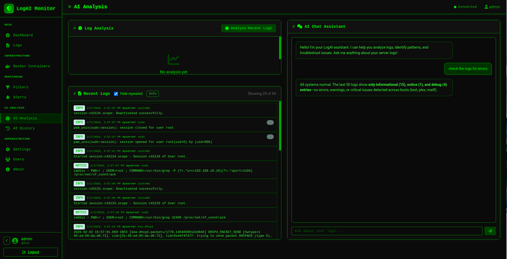
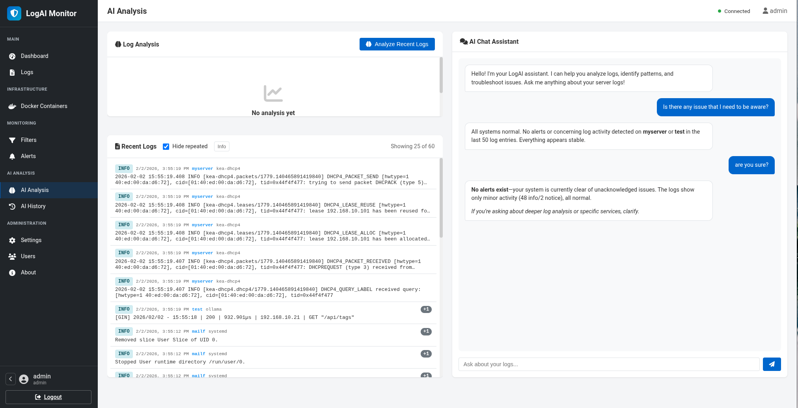

<h1 align="center">🛡️ LogRadarAI — LogAI Monitor</h1>

<p align="center">
  <strong>A powerful log monitoring and analysis application that collects logs from Linux servers (via rsyslog) and Docker containers, analyzes them using local AI (Ollama), and sends intelligent alerts via Telegram.</strong><br>
  Practical and easy to deploy and operate.  
  <strong>Note:</strong> LogRadarAI focuses on **recent logs** for real-time analysis and alerting; it is *not* designed to provide a permanent log archive or long-term history.
</p>

<p align="center">
  
  
  
  
  <a href="https://hub.docker.com/r/ftsiadimos/logradaraiq"></a>
  <a href="https://github.com/users/ftsiadimos/packages/container/package/logaimonitor"></a>
</p>

---

## Table of Contents

- [Features](#features)
- [Architecture](#architecture)
- [Quick Start](#quick-start)
- [Docker Compose](#docker-compose)
- [Manual Installation](#manual-installation)
- [Configuration](#configuration)
- [Usage](#usage)
- [Troubleshooting](#troubleshooting)
- [Contributing](#contributing)
- [License](#license)

---

## 📸 Screenshots

| Dark Theme | Lite Theme |
| --- | --- |
| <a href="mis/image1.png" target="_blank"></a> | <a href="mis/image.png" target="_blank"></a> |
| *AI Analyzer* | *AI Analyzer* |

---

## Features

- 📊 **Dashboard** - Real-time overview of log statistics and system health
- 📝 **Log Collection** - Collect logs from rsyslog (UDP/TCP) and Docker containers
- 🤖 **AI Analysis** - Analyze logs using local Ollama AI for intelligent insights
- 🔔 **Smart Alerts** - Create filters to detect specific patterns and receive Telegram notifications
- 🐳 **Docker Integration** - Auto-discover and monitor Docker container logs
- 💬 **AI Chat** - Interactive chat assistant for log troubleshooting
- 🎨 **Modern UI** - Clean, responsive interface inspired by oVirt/Foreman

## Architecture

```
┌─────────────────┐     ┌─────────────────┐
│  Linux Servers  │────▶│   Syslog UDP    │
│   (rsyslog)     │     │   Port 5514     │
└─────────────────┘     └────────┬────────┘
                                 │
┌─────────────────┐     ┌────────▼────────┐     ┌─────────────────┐
│    Docker       │────▶│   LogAI         │────▶│     Redis       │
│   Containers    │     │   Monitor       │     │   (Storage)     │
└─────────────────┘     └────────┬────────┘     └─────────────────┘
                                 │
                        ┌────────▼────────┐     ┌─────────────────┐
                        │   Ollama AI     │────▶│    Telegram     │
                        │   (Analysis)    │     │   (Alerts)      │
                        └─────────────────┘     └─────────────────┘
```

## Quick Start

### Using Docker Compose (Recommended)

1. Clone the repository:
```bash
git clone https://github.com/yourusername/logaimonitor.git
cd logaimonitor
```

2. Copy the example Compose file and edit it (or use the web UI later to change settings):
```bash
cp docker-compose.example.yml docker-compose.yml
# Edit `docker-compose.yml` to set required environment variables (e.g. SECRET_KEY, OLLAMA_HOST, TELEGRAM_BOT_TOKEN, TELEGRAM_CHAT_ID),
# or leave them as defaults and change them later via the web UI in Settings.
```

3. Start the application:
```bash
# Using Docker Compose v2
docker compose up -d
```
> ⚠️ **Default Credentials:**  
> **Username:** `admin` / **Password:** `admin`  
> **Important:** For security, change these credentials after your first login!

4. Access the web interface at `http://localhost:5059`

### Manual Installation

1. Install dependencies:
```bash
pip install -r requirements.txt
```

2. Start Redis:
```bash
docker run -d --name redis -p 6379:6379 redis:7-alpine
```

3. Install and start Ollama:
```bash
# Install Ollama
curl -fsSL https://ollama.ai/install.sh | sh

# Pull a model
ollama pull llama3.2

# Start Ollama server
ollama serve
```

4. Run the application:
```bash
python app.py
```

## Configuration

### Environment Variables

| Variable | Description | Default |
|----------|-------------|---------|
| `SECRET_KEY` | Flask secret key | `change-this` |
| `REDIS_HOST` | Redis hostname | `localhost` |
| `REDIS_PORT` | Redis port | `6379` |
| `OLLAMA_HOST` | Ollama API URL | `http://localhost:11434` |
| `OLLAMA_MODEL` | Ollama model name | `llama3.2` |
| `TELEGRAM_BOT_TOKEN` | Telegram bot token | - |
| `TELEGRAM_CHAT_ID` | Telegram chat ID | - |
| `LOG_RETENTION_HOURS` | Log retention period (only recent logs are kept; not a full history) | `2` (2 hours) |
| `ANALYSIS_INTERVAL_SECONDS` | Auto-analysis interval | `300` |

### Configuring Rsyslog

On your Linux servers, add this configuration to `/etc/rsyslog.d/99-logaimonitor.conf`:

```bash
# Forward all logs via UDP
*.* @logaimonitor-host:5514

# Or via TCP (more reliable)
*.* @@logaimonitor-host:5515
```

Then restart rsyslog:
```bash
sudo systemctl restart rsyslog
```

#### Forward Specific Logs Only

If you only want to forward certain log types:

```bash
# Only auth/security logs
auth,authpriv.* @logaimonitor-host:5514

# Only errors and above
*.err @logaimonitor-host:5514

# Kernel messages
kern.* @logaimonitor-host:5514
```

#### Test with logger command

Send a test log immediately:
```bash
logger -n logaimonitor-host -P 5514 -d "Test message from server"
```

### Collecting Docker Logs from External Hosts

For Docker containers running on **external/remote hosts**, you have several options:

#### Option 1: Docker Syslog Logging Driver (Recommended)

On the **remote Docker host**, configure containers to send logs via syslog:

```bash
# Run containers with syslog driver
docker run -d \
  --log-driver=syslog \
  --log-opt syslog-address=udp://logaimonitor-host:5514 \
  --log-opt tag="{{.Name}}" \
  your-image
```

Or set as the default for all containers in `/etc/docker/daemon.json`:
```json
{
  "log-driver": "syslog",
  "log-opts": {
    "syslog-address": "udp://logaimonitor-host:5514",
    "tag": "{{.Name}}"
  }
}
```

Then restart Docker:
```bash
sudo systemctl restart docker
```

#### Option 2: Expose Docker Remote API

On the **remote host**, edit `/etc/docker/daemon.json`:
```json
{
  "hosts": ["unix:///var/run/docker.sock", "tcp://0.0.0.0:2375"]
}
```

Then on LogAI Monitor, set the environment variable:
```bash
DOCKER_SOCKET=tcp://remote-host:2375
```

⚠️ **Warning**: This exposes Docker without authentication. Use TLS certificates for production or restrict with firewall rules.

#### Option 3: Forward via rsyslog on Remote Host

Install rsyslog on the remote Docker host and configure journald forwarding:

```bash
# /etc/rsyslog.d/99-docker-forward.conf
module(load="imjournal")
:programname, startswith, "docker" @logaimonitor-host:5514
```

> **Recommendation**: Option 1 (syslog driver) is the easiest and most secure - no extra configuration on LogAI Monitor needed, logs appear as syslog entries.

### Setting up Telegram Notifications

1. Create a bot with [@BotFather](https://t.me/BotFather) on Telegram
2. Copy the bot token
3. Send a message to your bot
4. Get your chat ID from `https://api.telegram.org/bot<TOKEN>/getUpdates`
5. Configure in Settings or via environment variables

## Usage

### Creating Filters

Filters allow you to monitor specific log patterns:

1. Go to **Filters** in the sidebar
2. Click **Create Filter**
3. Configure conditions:
   - **Severity**: Match specific severity levels
   - **Source Contains**: Match logs from specific sources
   - **Message Contains**: Match logs containing specific text
   - **Message Regex**: Advanced pattern matching
4. Enable Telegram notification if desired
5. Save the filter

### AI Analysis

1. Go to **AI Analysis** in the sidebar
2. Click **Analyze Recent Logs** for batch analysis
3. Use the **Chat Assistant** to ask questions about your logs
4. Click on any log entry and use **Analyze with AI** for detailed analysis

### Viewing Docker Logs

1. Go to **Docker Containers** in the sidebar
2. View all running containers
3. Click **Logs** to view container logs
4. Logs are automatically collected and analyzed

## API Reference

### Logs

- `GET /api/logs` - Get logs with filtering
- `GET /api/logs/<id>` - Get single log
- `POST /api/logs/ingest` - Ingest log via HTTP

### Filters

- `GET /api/filters` - List all filters
- `POST /api/filters` - Create filter
- `PUT /api/filters/<id>` - Update filter
- `DELETE /api/filters/<id>` - Delete filter

### Alerts

- `GET /api/alerts` - List alerts
- `POST /api/alerts/<id>/acknowledge` - Acknowledge alert

### AI

- `GET /api/ollama/status` - Check Ollama status
- `POST /api/ollama/analyze` - Analyze logs
- `POST /api/ollama/chat` - Chat with AI

### Settings

- `GET /api/settings` - Get settings
- `POST /api/settings` - Save settings
- `POST /api/telegram/test` - Test Telegram connection

## Ports

| Port | Protocol | Description |
|------|----------|-------------|
| 5059 | TCP | Web interface |
| 5514 | UDP | Syslog (UDP) |
| 5515 | TCP | Syslog (TCP) |

## Tech Stack

- **Backend**: Python, Flask, Flask-SocketIO
- **Storage**: Redis
- **AI**: Ollama (local LLM)
- **Notifications**: Telegram Bot API
- **Frontend**: HTML, CSS, JavaScript
- **Deployment**: Docker, Docker Compose

## Troubleshooting

### Logs not appearing

1. Check rsyslog configuration on source servers
2. Verify network connectivity (ports 5514/5515)
3. Check firewall rules
4. View LogAI Monitor logs: `docker-compose logs -f logaimonitor`

### Ollama not working

1. Verify Ollama is running: `curl http://localhost:11434/api/tags`
2. Check the model is pulled: `ollama list`
3. Verify `OLLAMA_HOST` environment variable

### Telegram not sending messages

1. Verify bot token is correct
2. Check chat ID (must start a conversation with bot first)
3. Use "Test Connection" in Settings

## Contributing

Contributions are welcome! Please read our contributing guidelines and submit pull requests.

## License

GPL-3.0 License - see LICENSE file for details.

Copyright (C) 2026 Fotios Tsiadimos

## Acknowledgments

- [Ollama](https://ollama.ai) - Local AI inference
- [Flask](https://flask.palletsprojects.com/) - Web framework
- [Redis](https://redis.io/) - In-memory data store
- [Font Awesome](https://fontawesome.com/) - Icons